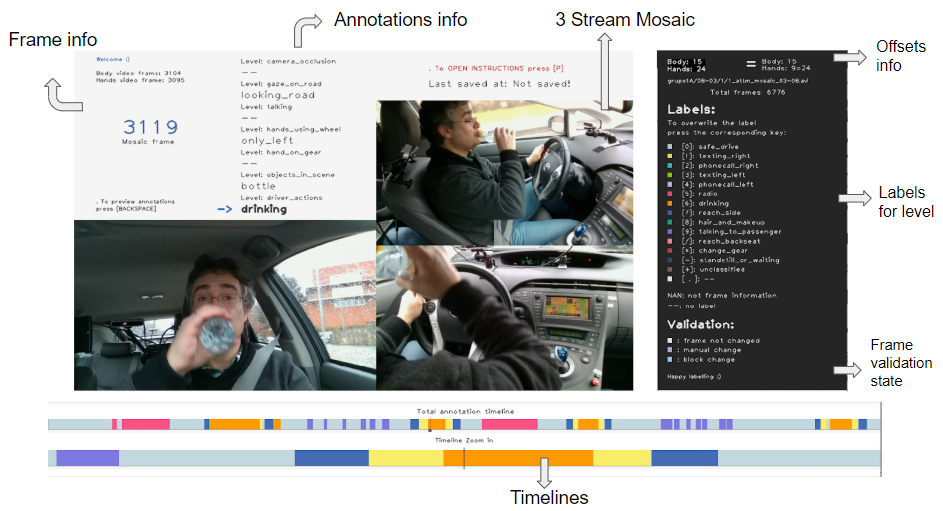
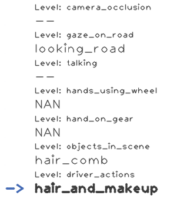
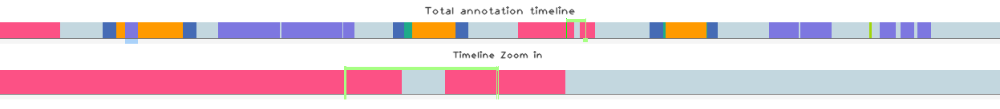

# Temporal Annotation Tool (TaTo)
We have acquired a good amount of high quality and friendly driver’s material in the DMD (Driver Monitoring Dataset) with the purpose of developing computer vision algorithms for driver monitoring. But what would be a dataset without its corresponding annotations? 

We developed the TaTo tool to annotate temporal events and actions performed by the drivers in the video sequences. The tool was used to annotate distraction-related actions. However, through configuration, other labels can be annotated.   

## Content
- [Temporal Annotation Tool (TaTo)](#temporal-annotation-tool-tato)
  - [Content](#content)
  - [Setup and Launching](#setup-and-launching)
  - [TaTo characteristics](#tato-characteristics)
  - [Usage Instructions](#usage-instructions)
    - [General functionality](#general-functionality)
    - [TaTo Window description](#tato-window-description)
    - [Annotating with TaTo](#annotating-with-tato)
      - [Select the annotation level](#select-the-annotation-level)
        - [Special labels](#special-labels)
      - [Annotation Modes](#annotation-modes)
        - [Frame-by-frame annotation](#frame-by-frame-annotation)
        - [Block annotation](#block-annotation)
        - [Automatic annotation](#automatic-annotation)
      - [Keyboard Interaction](#keyboard-interaction)
        - [General keys](#general-keys)
        - [Video Navigation](#video-navigation)
        - [Playback keys](#playback-keys)
        - [Annotation keys](#annotation-keys)
  - [Saving annotations](#saving-annotations)
  - [Annotation criteria](#annotation-criteria)
  - [Changelog](#changelog)
  - [FAQs](#faqs)
  - [Known Issues](#known-issues)
  - [License](#license)

## Setup and Launching
The TaTo tool has been tested using the following system configuration:

**OS:**           Ubuntu 18.04, Windows 10  
**Dependencies:** Python 3.8, OpenCV-Python 4.2.0, VCD>=6.0.3                        

For a detailed description on how to configure the environment and launch the tool, check: [Linux](../docs/setup_linux.md) / [Windows](../docs/setup_windows.md)

## TaTo characteristics
TaTo is a python keyboard-based software application to create and modify temporal annotations in [VCD 5.0. format](https://vcd.vicomtech.org/). It was planned to manage annotations from [DMD](http://dmd.vicomtech.org/) videos, but recently it was modified to be compatible with videos in general. It supports multi-label annotation and has an intuitive interface to visualize temporal annotations through timelines. It offers the following features:

- Allows the annotation of temporal events in videos (not only from the DMD). 
- The annotations could be divided in up to 7 different annotation levels(group of labels). Within each group the labels are **mutually exclusive.**
- Levels and labels of annotation can be defined in a **configuration file** and TaTo can work with many of these files (one at a time).
- Annotations are represented by colors in two timelines. Each label has its own color.
- The labels can be input either frame-by-frame or by frame-block interval.
- There is a **validation property** per each frame that indicates how it was annotated: frame-by-frame or frame-block interval.
- The output annotations are saved in VCD format in a **JSON file**.
- For DMD default annotation modes, you can apply **automatic annotations**. That is, applying logically related annotations among levels.
- To avoid loss of progress, the tool **autosaves** annotations. This autosaving is done in txt files to not affect the tool performance.

## Usage Instructions

### General functionality
Its operation depends on a general configuration file **“config.json”**. The main options to configure are in the object **“tatoConfig”**, these are:

#### Annotation mode
DMD has predefined annotation modes. These annotation modes are defined by a group of labels related to an analysis dimension of the dataset. For example, there is the distraction annotation mode which includes labels like texting-left, drinking, etc. 
You can indicate the annotation mode in the “annotation_mode” field. To define a new annotation mode you must create a new configuration file and name it as: “config_$annModeName.json”. To create an annotation mode configuration file, we recommend duplicate and modify an existing one to avoid incompatibilities. Inside there must be the following JSON objects:

- **level_names:** this object lists the names of the levels of annotation. A level is a category of labels. Each label must be identified by a number as a string (e.g. “0”: "driver_actions").
- **level_types:** This object specifies the nature of each level in the VCD (action, object, stream_properties). Must be the same number of items as in level_names, and must share the same id (e.g. “0”, “1”).
- **$level_id:** For each level, there is an object to list its corresponding labels. The name of the object must match the id from level_names and level_types  (e.g. “0”, “1”). In the same way, the labels within each level must be identified by a number as a string (e.g. “0”: “safe_drive”). There are two standard labels with their corresponding id: “99”: “--” that represents the absence of a label in one frame and “100”: “NAN” that means there is no frame information. 
- **level_defaults:** In this object, the default label for level is defined. When the VCD is initially created from cero, all frames will be annotated with a default label. This label should be the most recurrent one in the video so the annotation effort is less. There must be the same number of items as in level_names, and must share the same id (e.g. “0”, “1”).
- **camera_dependencies:** The DMD annotation is done with a mosaic video that includes 3 perspective views. Some labels are camera-dependant, so when there is no frame showing from one perspective, there shouldn’t be an annotation from those perspective-dependant labels. To indicate these dependencies, there must be an array of the labels ids for each camera perspective (e.g. "face": [1,2]).

#### Dataset
This option is to identify if you are working with the DMD and load predefined configuration and validations of TaTo for this dataset. If it is different, then it loads a general configuration and allows annotating any video with VCD>=5.0.

#### Pre_annotate
We created automatic pre-annotations for the DMD, also the DMD has metadata and static annotations we had to include inside the VCD. To do this, we load them before creating a VCD. To activate this functionality, we added this configuration option. You must leave it with a value of 0 since pre-annotation only works internally. 

### TaTo Window description 
The annotation tool TaTo opens with three windows: 

The main window will display:
- The **mosaic video** consisting of three camera streams (these streams were previously synchronized).
- Frame information (current frame). The **current frame** is the mosaic frame. 
- The last time you saved your annotation (It is recommended to save your progress frequently).
- The [**annotation info**](#select-the-annotation-level) panel shows a list of levels (annotation groups) and the current label for each level at the current frame. **The level you are currently annotating is indicated with the “->” sign and is written in bold.**   

A second window (with dark background) will show:
- The **frame offsets** between video streams
- The **video path** you are annotating. 
- A list of the available **labels** of the current selected annotation level. Each label has a colored box and a key to press for annotation in brackets [ ]. Check [annotation instructions](#annotating-with-tato) to know how to input annotation for each level. 
- An informative list of possible frame validation states. 

In the third window there are **two timelines** which show video annotations in colors, depending on the level:
- The first is a full timeline from frame 0 to the total length of the video.
- The second is a zoomed timeline around the current frame always keeping the actual frame in the center of the window. This timeline helps the visualization of individual frame label.

The colors in the timeline representation are the same as the colors in the label description panel. The colors and labels depend on the selected annotation level.

When there are 5 frames left, there will appear a “last frames” text and a “LAST FRAME!” text at the last frame. 

### Annotating with TaTo
The interaction with the tool is meant to be done using the keyboard.  We have a thorough list of keys available for interaction and annotation. Once the tool is open, you can press <kbd>P</kbd> to open instructions. 

#### Select the annotation level
An annotation level is a group of labels which are mutually exclusive (two or more labels of the same level cannot be assigned to the same frame). The definition of these levels and their corresponding labels is taken from a [config file](../annotation-tool/config_distraction.json).  

There are some annotation levels which require all frames to have a label. However, other levels can admit frames with no label. This depends on the nature of the annotation level. Annotation levels with empty labels will include this option in the config file. 

The first step to start annotating a video is to **select the annotation level**. You can see the current selected level in the main window's annotation info panel (see figure below). The current selected level will display an arrow "->" symbol and the current label will be highlighted in bold text. To change between levels use the <kbd>Tab</kbd> key.

##### Special labels
All the annotations levels will have a group of text labels which are used to annotate the temporal events. However, you will see two special labels displayed in the [annotation info panel](../docs/imgs/level_panel.png):

- **"NAN"**: This means there is not a frame from the camera stream used to annotate that level. This label is automatically set by the tool, it is not possible to change it manually. 
- **"--"**: This means absence of label. Some levels don't require to have continuos annotation labels so this "empty" label should be present. For those levels which requires continuos annotations, this "empty" label should not be present. Please consult the annotation criteria to know level characteristics. 

#### Annotation Modes
The annotation tool has two modes of annotation: **frame-by-frame** and **block** annotation.

##### Frame-by-frame annotation
This is the basic annotation mode. To annotate frame-by-frame you should first [select the annotation level](#select-the-annotation-level) you would want to annotate. Then, press the corresponding [label key](#annotation-keys) according to the list of available labels located in the window with dark background. The key to press will be in brackets [ ] on the left of each label. Once you press the key, the frame color in timeline will change. 

##### Block annotation
This is a handy way to annotate a frame interval. For this, you should first select the frame interval to be annotated. To do so, press the <kbd>Z</kbd> key to select the starting frame. Then, move forward or backward with the [navigation keys](#video-navigation). You will see in the timeline window your selection of the frame interval in green. After selecting the desired frame interval, press the corresponding [label key](#annotation-keys) to annotate all frames in the interval with that label.      

To unselect a frame interval press two times the <kbd>Z</kbd> key. 

##### Automatic annotation
In the case of DMD, there are logical relationships between different levels of annotation. For example, if the driver is performing the activity “Texting left”, then the annotation in hands_using_wheel level should be “Only Right”. There is a function that allows applying these logical annotations and change the related labels from different levels depending on the driver_actions level. 

It is important that you use this function after you have completed the annotations of driver_actions, then perform the automatic annotation changes to the rest of levels. The key to do this in the tool is <kbd>x</kbd> and is a just one-time operation. Mor info [here](https://github.com/Vicomtech/DMD-Driver-Monitoring-Dataset/wiki/DMD-distraction-related-action-annotation-criteria#apply-automatic-annotation-interpolation-warning).

#### Keyboard Interaction
##### General keys
|       Keys       |                    Function                      |
| :--------------: | :----------------------------------------------- |
| <kbd>Esc</kbd>   | **Close** the tool, saving the current progress  |
| <kbd>Enter</kbd> | **Save** the current annotation progress         |
| <kbd>P</kbd>     | Open a help window showing the available keys    |

##### Video Navigation
|        Keys        |                        Function                          |
| :----------------: | :------------------------------------------------------- |
| <kbd>Any Key</kbd> | Besides function specific keys, move forward **1 frame** |
| <kbd>E</kbd>       | Move **forward 50 frames**                               |
| <kbd>R</kbd>       | Move **forward 300 frames**                              |
| <kbd>W</kbd>       | Move **backwards 50 frames**                             |
| <kbd>Q</kbd>       | Move **backwards 300 frames**                            |
| <kbd>Space</kbd>   | Move **backwards 1 frame**                               |
| <kbd>S</kbd>       | **Jump forward** to nearest label change                 |
| <kbd>A</kbd>       | **Jump backwards** to nearest label change               |

##### Playback keys
This is a functionality where you can play and visualize the video along with the annotations from all levels. Can be used to check annotations or to navigate in timeline. 

|         Keys         |                                                 Function                                                      |
| :------------------: | :------------------------------------------------------------------------------------------------------------ |
| <kbd>Backspace</kbd> | Opens the **playback of the video** in a new window.                                                          |
| <kbd>Enter</kbd>     | In the playback window, closes the playback window returning to the main window at the **last frame played**  |
| <kbd>Esc</kbd>       | In the playback window, closes the playback window returning to the main window at the **first frame played** |

##### Annotation keys
|       Keys       |                    Function                                               |
| :--------------: | :------------------------------------------------------------------------ |
| <kbd>Tab</kbd>   | **Switch** between annotation levels                                      |
| <kbd>Z</kbd>     | **Select/Unselect** the starting frame for block annotation (key-frame)   |  
| <kbd>0</kbd>...<kbd>9</kbd>, <kbd>/</kbd>, <kbd>*</kbd>, <kbd>-</kbd>, <kbd>+</kbd> | **Annotate** the frame or frame interval with the corresponding label.                         |
| <kbd>.</kbd> | **Remove** the current label of the frame or frame interval                   |
| <kbd>X</kbd>     | Apply **automatic annotations** to other levels. :warning: **Caution: This is a destructive action, apply carefully.**                           |

## Saving annotations
You can save the progress by pressing the <kbd>Enter</kbd> key. The tool also saves the progress when you exit the tool using the <kbd>Esc</kbd> key.

**The tool saves the annotations in VCD 4 format in a JSON file.**

The tool has an autosave functionality that creates two TXT files with the annotation information. If a VCD file is successfully saved, then autosave TXT files will be deleted automatically. The name of these files are:
 - [video_name]_autoSaveAnn-A.txt
 - [video_name]_autoSaveAnn-B.txt

**In case something occurs and the tool exits without you manually saving the progress, you can recover your progress with these temporal TXT files.**

If there was a failure in saving the VCD, you will have **both** JSON and TXT files in the video directory. If you try to run the tool again, you should receive an error telling you to keep the most recent file. If that is the case, **delete** the VCD (JSON) file and start TaTo again. 

You could know which file is taken by TaTo during start-up time, depending on the file the tool is reading the annotations from, it should print:

- *"Loading VCD ..."* if the annotations are taken from a VCD json file.
- *"Loading provisional txt annotation files ..."* if the autoSave txt files are loaded.  

## Annotation criteria 
Depending on the annotation problem, different annotation criteria should be defined to guarantee all the annotators produce the same output annotations.  

We have defined the following criteria to be used with tool to produce consistent annotations:

- [DMD Distraction-related actions](https://github.com/Vicomtech/DMD-Driver-Monitoring-Dataset/wiki/DMD-distraction-related-action-annotation-criteria) annotation

## Changelog
For a complete list of changes check the [CHANGELOG.md](../CHANGELOG.md) file

## FAQs

- **How can I change the labels name?**

The number of labels per level and their names are specified at the [config file](../annotation-tool/config_distraction.json). You can change them there and restart the tool. You can also add more labels. If you delete labels, some problems of compatibility might appear. You can create your own config file and define your levels and labels of annotation.

- **What if I forgot to save?**

Relax, it happens. The tool saves progress when you press <kbd>Esc</kbd> and exit the tool. If you forgot to save and there was a sudden problem with the tool, there are autosave files that can help you recover your unsaved progress. Go to: [Saving annotations](#saving-annotations)

- **The tool gives the error: Incompatible file name. Please check your file name or folder structure.**

This error appears when the path or the folder structure of the video you had input is not valid or has not correct DMD nomenclature [DMD File Structure](https://github.com/Vicomtech/DMD-Driver-Monitoring-Dataset/wiki/DMD-file-struct). Also, make sure that the path you are inserting is the one form the **mosaic video** and not from the annotations. 

- **I have the error: There are two annotation files: VCD and txt. Please, keep only the most recent one. You can delete '..ann.json' file or '..autoSaveAnnA.txt and ..autoSaveAnnB.txt' files.**

That error appears when there are two kinds of annotations files, the VCD file and autosave TXT files. This means that the VCD file has not been saved successfully for some reason and there is a backup of your unsaved progress in the txt files. You can check if there are annotations inside the TXT files and go ahead and delete the VCD. When you open the tool again, it will create a VCD from the TXT files and everything will be fine again :) 

- **I'm pressing the keys to navigate through timeline but it does not move**

Check if any other support window apart from the 3 main windows is open, like instructions window. If so, you can close it with <kbd>Esc</kbd> or pressing the "x" directly on the window. 

- **If the main window goes dark while there is a "Saving..." sign, does it still saving?**

Yes. Depending on the VCD file size, it can take a while to save the progress and the main windows turn dark. We understand that it seems like there has been a problem and the tool is not responding, but don't worry, is normal :)

- **What are the static annotations shown in the console?**

Besides of temporal annotations, each video has context annotations, driver info and properties that we call static annotations. These are within VCD file since this format allows to include all kinds of annotations. You can access the VCD file to use those annotations. 

## Known Issues

|        Issue        |                        Solution                          |
| ------------------- | :------------------------------------------------------- |
| When pressed <kbd>Alt Gr</kbd> the tool exists abruptly  | This is caused due to a bug in the capture system dependency used in the tool. Please **Don't press** <kbd>Alt Gr</kbd> |

:warning: If you find any bug with the tool or have ideas of new features please open a new issue using the [bug report template](../docs/issue_bug_template.md) or the [feature request template](../docs/issue_feature_template.md) :warning:
