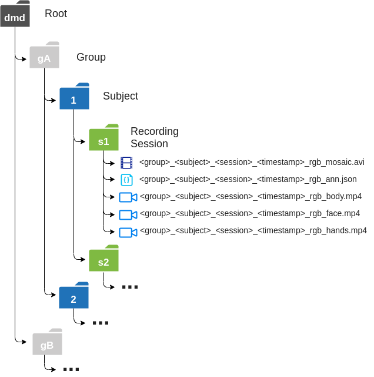

# DMD file structure

The DMD dataset is organized in folders according to the driver group, ID, and recording session. 
Within each recording session folder the RGB, IR and Depth videos for each camera are available. In addition a JSON file containing the annotations is also distributed. To facilitate the annotation process we have generated a mosaic video from the 3 camera streams which is the video to be passed to the temporal annotation tool (TaTo). 

The file struture is depicted in the following figure:

