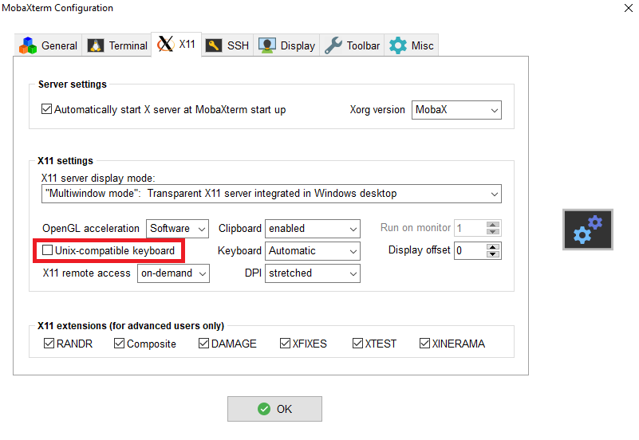

# Setting up the Temporal Annotation Tool (TaTo) - Windows

## Dependencies
The TaTo tool has been tested using the following system configuration:

**OS:**           Windows with WSL (Ubuntu 18.04) <br>
**X server:**     [MobaXTerm](https://mobaxterm.mobatek.net/) or [VcXsrv](https://sourceforge.net/projects/vcxsrv/)  
**Dependencies:** Python 3, OpenCV-Python 4.2.0, VCD 4.2.0                        

## Environment for WSL in Windows

### Activate **Windows Subsystem for Linux** 
- Open PowerShell as Administrator and run:
  ``` powershell
  Enable-WindowsOptionalFeature -Online -FeatureName Microsoft-Windows-Subsystem-Linux
  ```
  Restart when promped

- Install a distribution of Ubuntu from **Microsoft Store** (e.g. **Ubuntu 18.04**). 
  After installing run Ubuntu terminal and run:
  ``` bash
  sudo apt-get update && sudo apt-get upgrade
  ```
- Download [MobaXterm Portable Edition](https://mobaxterm.mobatek.net/download-home-edition.html)
  - Change keyboard configuration in MobaXterm

    **Unix-compatible keyboard** -> disable

    

- Open Ubuntu in a WSL session in MobaXterm.
- Verify pip is installed, if not install:
  ```bash
  sudo apt-get install python3 python3-pip
  ```
  ```bash
  pip3 install --upgrade pip
  ```
- (Optional) It is recommended to create a virtual environment in Python 3 (more info [here](https://packaging.python.org/guides/installing-using-pip-and-virtual-environments/)):
  - Configure a new virtual environment:
    ```bash
    pip3 install venv
    ```
    ```bash
    mkdir anntool_py
    ```
    ```bash
    python3 -m venv anntool_py
    ```
  - Activate the virtual environment:
    ```bash
    source anntool_py/bin/activate
    ```
- Install the dependencies
  ``` bash
  pip3 install opencv-python numpy vcd
  ```
- Go to [directory](../annotation-tool) that contains the tool scripts.

## Launching TaTo
In a MobaXterm WSL session, within the folder [annotation_tool](../annotation-tool) run 

```bash
./annotate.sh
```

**Note:** To access your C:/ drive within Ubuntu in WSL you need to type:

```bash
cd /mnt/c/<path to scripts>
```

The tool will ask you to input the **path** of the mosaic video you want to annotate. Please insert the path following the [DMD file structure](../docs/dmd_file_struct.md). 

The annotation tool TaTo opens with three windows